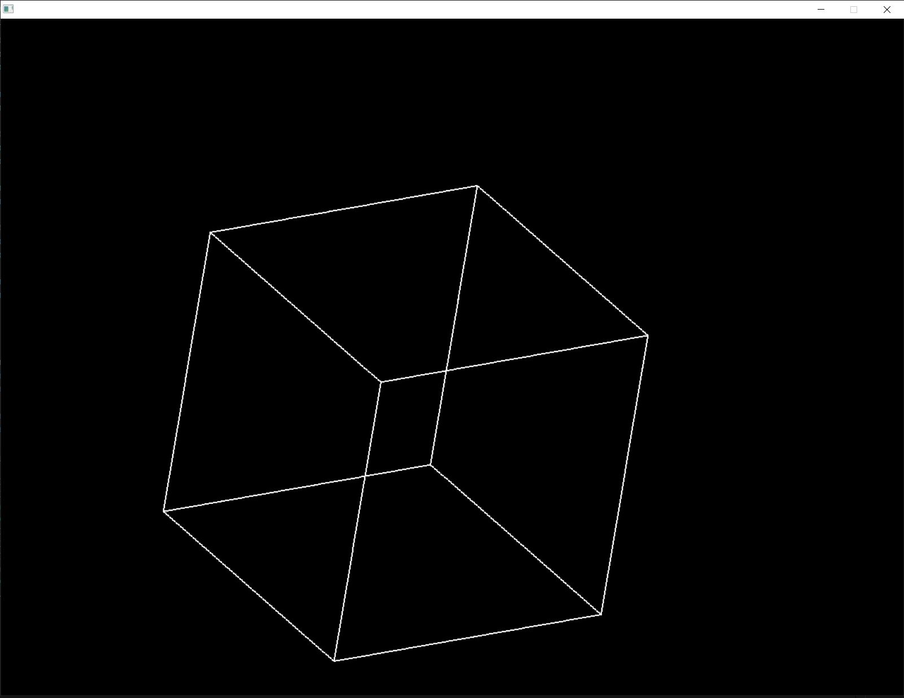
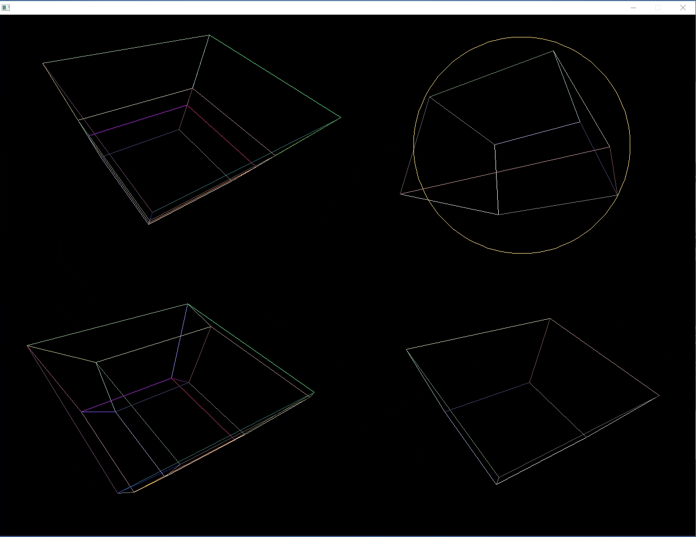

# Project Title  
This is an example of an in-depth ReadMe.  

## Badges  

Add badges from somewhere like: [shields.io](https://shields.io/)  
  
  

# Table of contents  
1. [Introduction](#introduction)  
2. [Some paragraph](#paragraph1)  
    1. [Sub paragraph](#subparagraph1)  
3. [Another paragraph](#paragraph2)  

## Screenshots  

## Tech Stack  

**Client:** React, Redux, TailwindCSS  

**Server:** Node, Express

## Features  

- Light/dark mode toggle  
- Live previews  
- Fullscreen mode  
- Cross platform 

## Lessons Learned  

What did you learn while building this project? What challenges did you face and how did you overcome t

## Run Locally  

Clone the project  

~~~bash  
  git clone https://link-to-project
~~~

Go to the project directory  

~~~bash  
  cd my-project
~~~

Install dependencies  

~~~bash  
npm install
~~~

Start the server  

~~~bash  
npm run start
~~~

## Environment Variables  

To run this project, you will need to add the following environment variables to your .env file  
`API_KEY`  

`ANOTHER_API_KEY` 

## Acknowledgements  

- [Awesome Readme Templates](https://awesomeopensource.com/project/elangosundar/awesome-README-templates)
- [Awesome README](https://github.com/matiassingers/awesome-readme)
- [How to write a Good readme](https://bulldogjob.com/news/449-how-to-write-a-good-readme-for-your-github-project)

## Feedback  

If you have any feedback, please reach out to us at fake@fake.com

## License  

[MIT](https://choosealicense.com/licenses/mit/)

# Project 5: DrawPixel in C++
# Overview
This project is a simple 3D wireframe renderer developed in C++ using the SDL2 library. It visualizes a rotating 3D cube by projecting its vertices onto a 2D screen and drawing the connecting edges. The application demonstrates fundamental concepts in graphics programming, including rendering loops, event handling, and basic 3D transformations. 

## Demo  

> > 

## AI enhanced:
> > 

 

# Project Structure
- main.cpp: Contains the main application logic, including the rendering loop, event handling, and 3D transformations.
- screen.h: Defines the Screen class, which manages the SDL2 window, renderer, and drawing operations.

## Run Locally  

Clone the project  

~~~bash  
  git clone https://github.com/luongkhdang/Project-5--DrawPixel-with-CPP--.git
~~~

Go to the project directory  

~~~bash  
  cd my-project
~~~

 
Requirement:
  SDL2 // SDL2 is included (lib and include folder)

To Start:

~~~bash  
g++ -fdiagnostics-color=always -g "main.cpp" -o "main.exe" -I "/include" -L "/lib" -lmingw32 -lSDL2main -lSDL2 -mconsole 
~~~

Insert directory of main.cpp, main.exe, /include, and /lib.
For example:
~~~bash 
C:/msys64/ucrt64/bin/g++.exe -fdiagnostics-color=always -g "C:\PROGRAMMING\BIG PROJECT\DrawPixel with C++\main.cpp" -o "C:\PROGRAMMING\BIG PROJECT\DrawPixel with C++\main.exe" -I "C:/PROGRAMMING/BIG PROJECT/DrawPixel with C++/include" -L "C:/PROGRAMMING/BIG PROJECT/DrawPixel with C++/lib" -lmingw32 -lSDL2main -lSDL2 -mconsole 
~~~

## Features  

* 3D Rendering: Visualizes a rotating 3D cube by projecting 3D points onto a 2D screen.
* Interactive Window: Handles window events, allowing users to close the application gracefully.
* Basic Transformations: Implements rotation around the X, Y, and Z axes.
* Efficient Rendering: Uses SDL2 for rendering points and lines efficiently.

# Prerequisites

Before diving into this project, you should have a solid understanding of the following topics:

* C++ Programming:

  - Basic syntax and structure
  - Object-oriented programming concepts (classes, objects, constructors, destructors)
  - Standard Template Library (STL) usage (e.g., std::vector)
* SDL2 Library:

  - Installation and setup of SDL2 in your development environment
  - Basic SDL2 concepts (windows, renderers, events)
* Basic Mathematics:

  - Understanding of vectors and points in 3D space
  - Basic trigonometry (sine and cosine functions)
  - 3D rotation transformations

# What You'll Learn

Working on this project will help you develop and reinforce the following skills:

* Graphics Programming with SDL2:

  - Setting up an SDL2 window and renderer
  - Drawing pixels and lines to represent 3D objects on a 2D screen
  - Managing the rendering loop and frame updates
* 3D Transformations:

  - Implementing rotation transformations around different axes
  - Understanding the mathematics behind projecting 3D points onto a 2D plane
* Event Handling:

  - Managing user inputs and window events to ensure smooth application behavior
* Optimizing Rendering:

  - Efficiently managing and rendering multiple points and connections

## AI enhanced: 
* Using ChatGPT o1 to implement the following:

- Explanation of Implemented Features:
1) 4-dimention to quadrant 1 and 3
2) Quaternion Implementation:
Introduced a Quaternion class to handle rotations.
Replaced Euler angle rotations with quaternion-based rotations for smooth and gimbal-lock-free rotation.

3) Cube Definition:
Defined the cube vertices in a normalized space (-1 to 1).
Defined connections (edges) between the cube vertices.

4) Perspective Projection:
Implemented a simple perspective projection in the project function.
Transformed 3D coordinates to 2D screen space.

5) Double Buffering:
Utilized SDL's double buffering by calling SDL_RenderPresent after all drawing commands.
Ensured smooth rendering without flickering.

6) Limit Rotations:
Allowed the user to adjust rotation speeds but kept them within reasonable limits.

7) Screen Splitting:
Divided the window into four quadrants using SDL_RenderSetViewport.
Each viewport renders the cube with different transformations.

8) Rendering Loop:
Iterated over each viewport, applied specific rotations, and rendered the cube accordingly.

9) Rendering Optimization:
Reserved space in the projectedPoints vector to reduce reallocations.
Used SDL_RenderDrawLineF for efficient line drawing.

10) Different Transformations per Viewport:
Viewport 0: the cube rotates in the x-w plane.
Viewport 1: Increased rotation speed for extra dynamism, added a pulsating golden sphere that changes size over time.
Viewport 2: the cube rotates in the y-w plane.
Viewport 3: Reverse rotation on the Z-axis and zoomed-in view.

11) Visual Effects:
Implemented color coding for different edges:
Defined a vertexColors vector containing colors for each vertex.
Modified the drawLine function to interpolate colors between connected vertices.
The cube's edges now display gradient colors based on the connected vertices.
 
12) Performance Profiling:
Ensured efficient rendering by optimizing loops and minimizing function calls.
Used SDL_Delay(16) to cap the frame rate at approximately 60 FPS.

## License  

This project is licensed under the [MIT](https://choosealicense.com/licenses/mit/) License. Feel free to use, modify, and distribute it as you see fit.